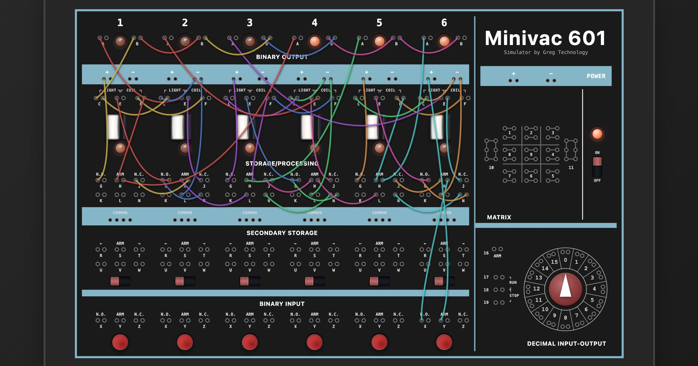

# Minivac 601 Simulator

A web simulator for the [Minivac 601](https://en.wikipedia.org/wiki/Minivac_601), an early electronics kit created by Claude Shannon.

[See the simulator here!](https://minivac.greg.technology/)

Also, [play Tetris here](https://minivac.greg.technology/tetris/) - implemented exclusively using simulated Minivacs!

### Credits

Underlying electrical circuit simulator: [circuit-sandbox](https://github.com/willymcallister/circuit-sandbox) by Willy McAllister.